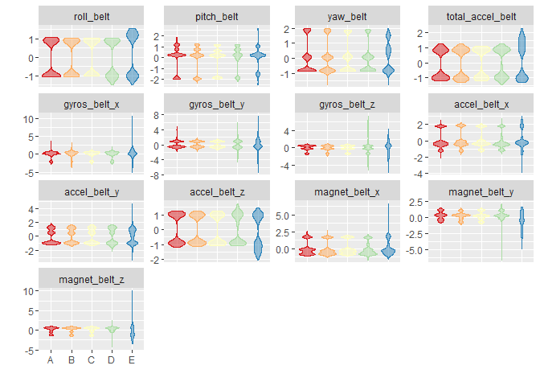
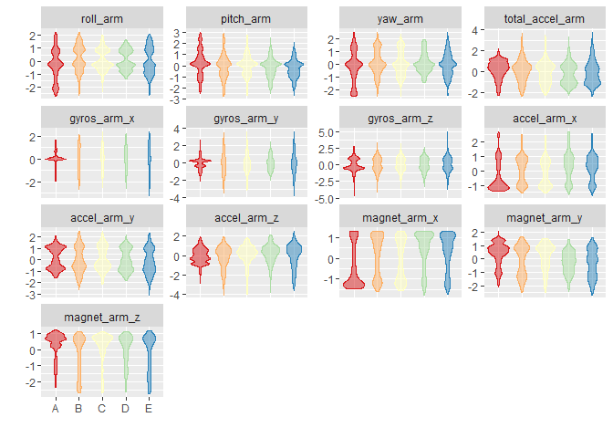
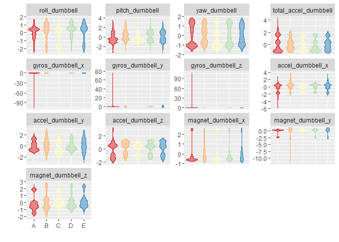
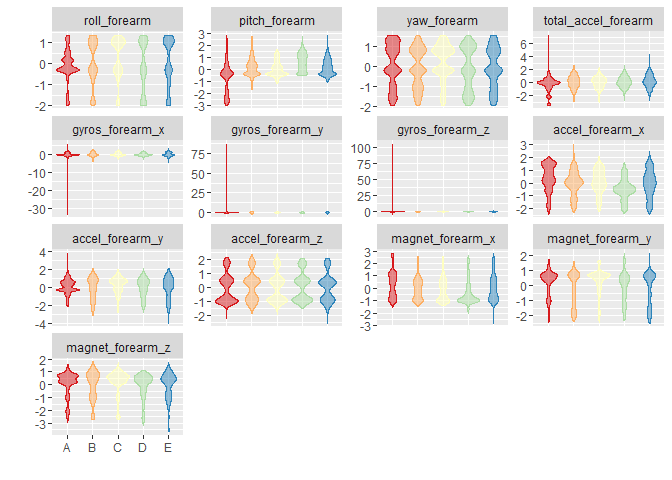

# Practical-Machine-Learning Prediction Project
Jay Lee  
2016-05-15  


# Background

Using devices such as Jawbone Up, Nike FuelBand, and Fitbit it is now possible to collect a large amount of data about personal activity relatively inexpensively. These type of devices are part of the quantified self movement – a group of enthusiasts who take measurements about themselves regularly to improve their health, to find patterns in their behavior, or because they are tech geeks. One thing that people regularly do is quantify how much of a particular activity they do, but they rarely quantify how well they do it. In this project, your goal will be to use data from accelerometers on the belt, forearm, arm, and dumbell of 6 participants. They were asked to perform barbell lifts correctly and incorrectly in 5 different ways. More information is available from the website here: <http://groupware.les.inf.puc-rio.br/har> (see the section on the Weight Lifting Exercise Dataset).

# Data

The training data for this project are available here:

<https://d396qusza40orc.cloudfront.net/predmachlearn/pml-training.csv>

The test data are available here:

<https://d396qusza40orc.cloudfront.net/predmachlearn/pml-testing.csv>

## Prepare the datasets

Load libraries.


```r
library(caret)        # with lattice & ggplot2
library(reshape2)     # for melt
library(parallel)     # for makeCluster
library(doParallel)   # for registerDoParallel with foreach
library(randomForest)
```

Load the training and testing data.


```r
url1 <- "https://d396qusza40orc.cloudfront.net/predmachlearn/pml-training.csv"
training <- read.csv(url(url1), na.strings=c("NA","#DIV/0!",""))

url2 <- "https://d396qusza40orc.cloudfront.net/predmachlearn/pml-testing.csv"
testing <- read.csv(url(url2), na.strings=c("NA","#DIV/0!",""))
```

## Predictor candidates

Belt, arm, dumbbell, and forearm variables that do not have any missing values in the test dataset will be predictor candidates.


```r
isAnyMissing <- sapply(testing, function (x) any(is.na(x) | x == ""))
isPredictor <- !isAnyMissing & grepl("belt|[^(fore)]arm|dumbbell|forearm", names(isAnyMissing))
predCandidates <- names(isAnyMissing)[isPredictor]
predCandidates
```

```
##  [1] "roll_belt"            "pitch_belt"           "yaw_belt"            
##  [4] "total_accel_belt"     "gyros_belt_x"         "gyros_belt_y"        
##  [7] "gyros_belt_z"         "accel_belt_x"         "accel_belt_y"        
## [10] "accel_belt_z"         "magnet_belt_x"        "magnet_belt_y"       
## [13] "magnet_belt_z"        "roll_arm"             "pitch_arm"           
## [16] "yaw_arm"              "total_accel_arm"      "gyros_arm_x"         
## [19] "gyros_arm_y"          "gyros_arm_z"          "accel_arm_x"         
## [22] "accel_arm_y"          "accel_arm_z"          "magnet_arm_x"        
## [25] "magnet_arm_y"         "magnet_arm_z"         "roll_dumbbell"       
## [28] "pitch_dumbbell"       "yaw_dumbbell"         "total_accel_dumbbell"
## [31] "gyros_dumbbell_x"     "gyros_dumbbell_y"     "gyros_dumbbell_z"    
## [34] "accel_dumbbell_x"     "accel_dumbbell_y"     "accel_dumbbell_z"    
## [37] "magnet_dumbbell_x"    "magnet_dumbbell_y"    "magnet_dumbbell_z"   
## [40] "roll_forearm"         "pitch_forearm"        "yaw_forearm"         
## [43] "total_accel_forearm"  "gyros_forearm_x"      "gyros_forearm_y"     
## [46] "gyros_forearm_z"      "accel_forearm_x"      "accel_forearm_y"     
## [49] "accel_forearm_z"      "magnet_forearm_x"     "magnet_forearm_y"    
## [52] "magnet_forearm_z"
```

Subset the primary dataset to include only the predictor candidates and the outcome variable, classe.


```r
training <- training[, c("classe", predCandidates)]
dim(training)
```

```
## [1] 19622    53
```

```r
names(training)
```

```
##  [1] "classe"               "roll_belt"            "pitch_belt"          
##  [4] "yaw_belt"             "total_accel_belt"     "gyros_belt_x"        
##  [7] "gyros_belt_y"         "gyros_belt_z"         "accel_belt_x"        
## [10] "accel_belt_y"         "accel_belt_z"         "magnet_belt_x"       
## [13] "magnet_belt_y"        "magnet_belt_z"        "roll_arm"            
## [16] "pitch_arm"            "yaw_arm"              "total_accel_arm"     
## [19] "gyros_arm_x"          "gyros_arm_y"          "gyros_arm_z"         
## [22] "accel_arm_x"          "accel_arm_y"          "accel_arm_z"         
## [25] "magnet_arm_x"         "magnet_arm_y"         "magnet_arm_z"        
## [28] "roll_dumbbell"        "pitch_dumbbell"       "yaw_dumbbell"        
## [31] "total_accel_dumbbell" "gyros_dumbbell_x"     "gyros_dumbbell_y"    
## [34] "gyros_dumbbell_z"     "accel_dumbbell_x"     "accel_dumbbell_y"    
## [37] "accel_dumbbell_z"     "magnet_dumbbell_x"    "magnet_dumbbell_y"   
## [40] "magnet_dumbbell_z"    "roll_forearm"         "pitch_forearm"       
## [43] "yaw_forearm"          "total_accel_forearm"  "gyros_forearm_x"     
## [46] "gyros_forearm_y"      "gyros_forearm_z"      "accel_forearm_x"     
## [49] "accel_forearm_y"      "accel_forearm_z"      "magnet_forearm_x"    
## [52] "magnet_forearm_y"     "magnet_forearm_z"
```

```r
table(training[, 1])
```

```
## 
##    A    B    C    D    E 
## 5580 3797 3422 3216 3607
```

## Data splitting


```r
set.seed(as.numeric(as.Date("2016-05-15")))

inTrain <- createDataPartition(y=training$classe,p=0.6,list=FALSE)
trainingA <- training[inTrain,]
trainingB <- training[-inTrain,]
```

## Preprocess

Preprocess the prediction variables by centering and scaling.


```r
preObj <- preProcess(trainingA[, -1], method=c("center","scale"))
preObj
```

```
## Created from 11776 samples and 52 variables
## 
## Pre-processing:
##   - centered (52)
##   - ignored (0)
##   - scaled (52)
```

```r
trainingACS <- cbind(trainingA$classe, predict(preObj, trainingA[, -1]))
colnames(trainingACS)[1] <- "classe"

# Preprocess on the remaining dataset.
trainingBCS <- cbind(trainingB$classe, predict(preObj, trainingB[, -1]))
colnames(trainingBCS)[1] <- "classe"
```

Identify the near zero variance predictors.


```r
nzv <- nearZeroVar(trainingACS, saveMetrics=TRUE)
if (any(nzv$nzv)) nzv else message("No predictors with near zero variance.")
```

```
## No predictors with near zero variance.
```

Examine predictor variables.


```r
histGroup <- function (data, regex) {
  col <- grep(regex, names(data))
  col <- c(col, which(names(data) == "classe"))
  n <- nrow(data)
  DMelted <- melt(data[, col])
  ggplot(DMelted, aes(x=classe, y=value)) +
    geom_violin(aes(color=classe, fill=classe), alpha=1/2) +
    facet_wrap(~ variable, scale="free_y") +
    scale_color_brewer(palette="Spectral") +
    scale_fill_brewer(palette="Spectral") +
    labs(x="", y="") +
    theme(legend.position="none")
}
```


```r
histGroup(trainingACS, "belt")
```

```
## Using classe as id variables
```

<!-- -->

```r
histGroup(trainingACS, "[^(fore)]arm")
```

```
## Using classe as id variables
```

<!-- -->

```r
histGroup(trainingACS, "dumbbell")
```

```
## Using classe as id variables
```

<!-- -->

```r
histGroup(trainingACS, "forearm")
```

```
## Using classe as id variables
```

<!-- -->

## Train a prediction model

With random forest, train the prediction model.


```r
# parallel clusters
cl <- makeCluster(detectCores() - 1)
registerDoParallel(cl)

# control parameters
ctrl <- trainControl(classProbs=TRUE,savePredictions=TRUE,allowParallel=TRUE)

# model fit with caret
modFit <- train(classe ~ ., data=trainingACS, method="rf")

stopCluster(cl)
```

## Evaluate the prediction model on the training dataset


```r
modFit
```

```
## Random Forest 
## 
## 11776 samples
##    52 predictor
##     5 classes: 'A', 'B', 'C', 'D', 'E' 
## 
## No pre-processing
## Resampling: Bootstrapped (25 reps) 
## Summary of sample sizes: 11776, 11776, 11776, 11776, 11776, 11776, ... 
## Resampling results across tuning parameters:
## 
##   mtry  Accuracy   Kappa    
##    2    0.9853793  0.9815112
##   27    0.9859783  0.9822703
##   52    0.9797632  0.9744115
## 
## Accuracy was used to select the optimal model using  the largest value.
## The final value used for the model was mtry = 27.
```

```r
confusionMatrix(trainingA$classe, predict(modFit, trainingACS))
```

```
## Confusion Matrix and Statistics
## 
##           Reference
## Prediction    A    B    C    D    E
##          A 3348    0    0    0    0
##          B    0 2279    0    0    0
##          C    0    0 2054    0    0
##          D    0    0    0 1930    0
##          E    0    0    0    0 2165
## 
## Overall Statistics
##                                      
##                Accuracy : 1          
##                  95% CI : (0.9997, 1)
##     No Information Rate : 0.2843     
##     P-Value [Acc > NIR] : < 2.2e-16  
##                                      
##                   Kappa : 1          
##  Mcnemar's Test P-Value : NA         
## 
## Statistics by Class:
## 
##                      Class: A Class: B Class: C Class: D Class: E
## Sensitivity            1.0000   1.0000   1.0000   1.0000   1.0000
## Specificity            1.0000   1.0000   1.0000   1.0000   1.0000
## Pos Pred Value         1.0000   1.0000   1.0000   1.0000   1.0000
## Neg Pred Value         1.0000   1.0000   1.0000   1.0000   1.0000
## Prevalence             0.2843   0.1935   0.1744   0.1639   0.1838
## Detection Rate         0.2843   0.1935   0.1744   0.1639   0.1838
## Detection Prevalence   0.2843   0.1935   0.1744   0.1639   0.1838
## Balanced Accuracy      1.0000   1.0000   1.0000   1.0000   1.0000
```

```r
# evaluate remaining dataset
confusionMatrix(trainingBCS$classe, predict(modFit, trainingBCS))
```

```
## Confusion Matrix and Statistics
## 
##           Reference
## Prediction    A    B    C    D    E
##          A 2231    1    0    0    0
##          B   12 1498    7    1    0
##          C    0   12 1348    8    0
##          D    0    0   15 1270    1
##          E    0    1    6    4 1431
## 
## Overall Statistics
##                                          
##                Accuracy : 0.9913         
##                  95% CI : (0.989, 0.9933)
##     No Information Rate : 0.2859         
##     P-Value [Acc > NIR] : < 2.2e-16      
##                                          
##                   Kappa : 0.989          
##  Mcnemar's Test P-Value : NA             
## 
## Statistics by Class:
## 
##                      Class: A Class: B Class: C Class: D Class: E
## Sensitivity            0.9947   0.9907   0.9797   0.9899   0.9993
## Specificity            0.9998   0.9968   0.9969   0.9976   0.9983
## Pos Pred Value         0.9996   0.9868   0.9854   0.9876   0.9924
## Neg Pred Value         0.9979   0.9978   0.9957   0.9980   0.9998
## Prevalence             0.2859   0.1927   0.1754   0.1635   0.1825
## Detection Rate         0.2843   0.1909   0.1718   0.1619   0.1824
## Detection Prevalence   0.2845   0.1935   0.1744   0.1639   0.1838
## Balanced Accuracy      0.9972   0.9938   0.9883   0.9937   0.9988
```

## Final model


```r
varImp(modFit)
```

```
## rf variable importance
## 
##   only 20 most important variables shown (out of 52)
## 
##                      Overall
## roll_belt            100.000
## pitch_forearm         58.754
## yaw_belt              53.601
## pitch_belt            44.532
## magnet_dumbbell_z     43.566
## magnet_dumbbell_y     41.967
## roll_forearm          41.005
## accel_dumbbell_y      21.819
## magnet_dumbbell_x     18.030
## roll_dumbbell         16.619
## accel_forearm_x       16.319
## magnet_belt_z         14.308
## magnet_forearm_z      13.385
## accel_dumbbell_z      13.224
## total_accel_dumbbell  12.576
## magnet_belt_y         12.204
## accel_belt_z          12.191
## yaw_arm               10.616
## gyros_belt_z          10.587
## magnet_belt_x          9.752
```

```r
modFit$finalModel
```

```
## 
## Call:
##  randomForest(x = x, y = y, mtry = param$mtry) 
##                Type of random forest: classification
##                      Number of trees: 500
## No. of variables tried at each split: 27
## 
##         OOB estimate of  error rate: 0.83%
## Confusion matrix:
##      A    B    C    D    E class.error
## A 3343    3    1    0    1 0.001493429
## B   20 2251    8    0    0 0.012286090
## C    0   14 2030   10    0 0.011684518
## D    0    1   26 1900    3 0.015544041
## E    0    1    4    6 2154 0.005080831
```

## Predict on the test dataset


```r
testingCS <- predict(preObj, testing[, predCandidates])

prediction <- predict(modFit, testingCS)
testing <- cbind(prediction, testing)
subset(testing, select=names(testing)[grep("belt|[^(fore)]arm|dumbbell|forearm", names(testing), invert=TRUE)])
```

```
##    prediction  X user_name raw_timestamp_part_1 raw_timestamp_part_2
## 1           B  1     pedro           1323095002               868349
## 2           A  2    jeremy           1322673067               778725
## 3           B  3    jeremy           1322673075               342967
## 4           A  4    adelmo           1322832789               560311
## 5           A  5    eurico           1322489635               814776
## 6           E  6    jeremy           1322673149               510661
## 7           D  7    jeremy           1322673128               766645
## 8           B  8    jeremy           1322673076                54671
## 9           A  9  carlitos           1323084240               916313
## 10          A 10   charles           1322837822               384285
## 11          B 11  carlitos           1323084277                36553
## 12          C 12    jeremy           1322673101               442731
## 13          B 13    eurico           1322489661               298656
## 14          A 14    jeremy           1322673043               178652
## 15          E 15    jeremy           1322673156               550750
## 16          E 16    eurico           1322489713               706637
## 17          A 17     pedro           1323094971               920315
## 18          B 18  carlitos           1323084285               176314
## 19          B 19     pedro           1323094999               828379
## 20          B 20    eurico           1322489658               106658
##      cvtd_timestamp new_window num_window problem_id
## 1  05/12/2011 14:23         no         74          1
## 2  30/11/2011 17:11         no        431          2
## 3  30/11/2011 17:11         no        439          3
## 4  02/12/2011 13:33         no        194          4
## 5  28/11/2011 14:13         no        235          5
## 6  30/11/2011 17:12         no        504          6
## 7  30/11/2011 17:12         no        485          7
## 8  30/11/2011 17:11         no        440          8
## 9  05/12/2011 11:24         no        323          9
## 10 02/12/2011 14:57         no        664         10
## 11 05/12/2011 11:24         no        859         11
## 12 30/11/2011 17:11         no        461         12
## 13 28/11/2011 14:14         no        257         13
## 14 30/11/2011 17:10         no        408         14
## 15 30/11/2011 17:12         no        779         15
## 16 28/11/2011 14:15         no        302         16
## 17 05/12/2011 14:22         no         48         17
## 18 05/12/2011 11:24         no        361         18
## 19 05/12/2011 14:23         no         72         19
## 20 28/11/2011 14:14         no        255         20
```

